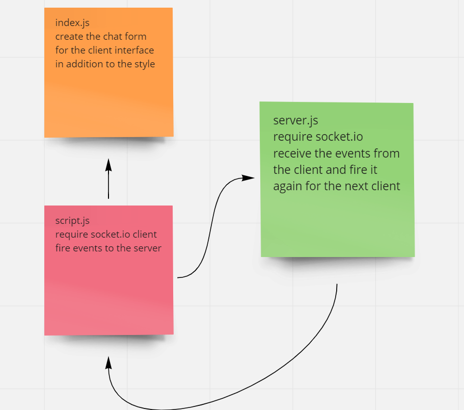

# chat_app

simple chat app.

## Discription:

this application is chat app where the clients can contact each others and there is the ability to join privet chat rooms to send messages to spacific clinet.

## how this app was built:

i used the socket.io to build this app where it used mainly to make the connction between the server and the clients
i did an html file to make simple chat user interface and create events and fire it from the client to the server and from the server to next client.

## how to run the app:

1- run the server using the node server.js
2- run the client on local host 8080 using npm run start
3- join a room
4- send a message
5- the server will recive the message and send it to the targeted client.

## UML:

## pull request:

https://github.com/saadomaralzoubi/chat_app/pull/1
